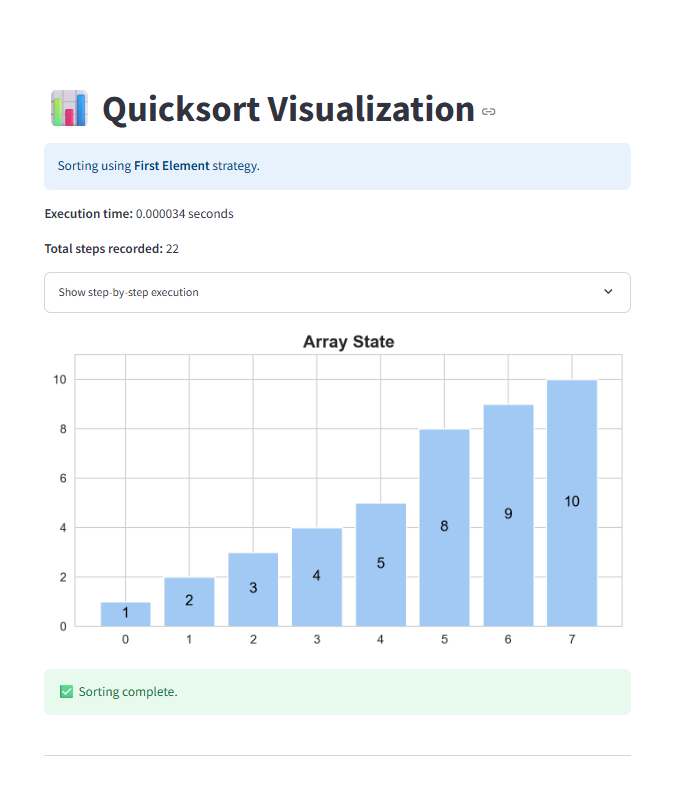

# Quicksort - Interactive Visualization

Welcome to the **Quicksort** interactive visualization project—an educational Streamlit web application developed for the Algorithms and Programming II course at Fırat University. This tool makes the divide-and-conquer strategy of Quicksort transparent by animating each comparison, swap, and recursive partition in real time.

---

##  Project Overview

This application allows users to:

* **Visualize** each step of the Quicksort algorithm on an input array.
* **Choose** different pivot selection strategies: First Element, Last Element, Median-of-Three, or Random.
* **Adjust** animation speed for step-by-step understanding.
* **Measure** execution time and observe how pivot choice affects performance.
* **Run** predefined test cases to verify correctness across scenarios.

---

##  Algorithm Description

### Problem Definition

Efficiently sort a list of numerical values into ascending order using the Quicksort algorithm.

### Mathematical Background

Quicksort is a divide-and-conquer algorithm that:

1. **Selects a pivot** element from the array.
2. **Partitions** the remaining elements into those less than or equal to the pivot and those greater.
3. **Recursively** applies the same process to the subarrays.
4. **Combines** results in-place, avoiding the need for additional merge steps.

### Pseudocode

```plaintext
function quicksort(arr, low, high):
    if low < high:
        p = partition(arr, low, high)
        quicksort(arr, low, p - 1)
        quicksort(arr, p + 1, high)

function partition(arr, low, high):
    pivot = arr[high]
    i = low
    for j from low to high - 1:
        if arr[j] <= pivot:
            swap(arr[i], arr[j])
            i = i + 1
    swap(arr[i], arr[high])
    return i
```

---

##  Complexity Analysis

* **Best Case:** O(n log n) — pivot splits arrays evenly.
* **Average Case:** O(n log n) — random pivots yield balanced partitions on average.
* **Worst Case:** O(n²) — highly unbalanced partitions (e.g., sorted input with poor pivot choice).
* **Space Complexity:** O(log n) auxiliary (average recursion stack); O(n) in worst case.

---

##  Features

* **Pivot Strategies:** First Element, Last Element, Median-of-Three, Random.
* **Step-By-Step Animation:** Adjustable speed slider for pause-and-examine.
* **Performance Metrics:** Execution time and total recorded steps.
* **Test Cases Demonstration:** Verify correctness on empty arrays, duplicates, reverse-sorted arrays, and more.

---

##  Screenshots

1. **Settings Panel**
2. ---
   
   ---
   *Enter an array, select pivot strategy, and adjust animation speed.*

4. **Main Visualization**
5. ---
   
   ---
   *Animated bar chart showing the current array state and execution summary.*

6. **Step-by-Step Explanation**
7. ---
   
   ---
   *Detailed view of each partition and swap.*

9. **Test Cases Table**
10. ---
   
   ---
   *Predefined scenarios with pass/fail results.*

---

##  Installation

Ensure you have Python 3.8+ installed. Then:

```bash
git clone https://github.com/your-username/your-repo.git
cd your-repo
pip install -r requirements.txt
streamlit run app.py
```

---

##  Usage Guide

1. **Input Array:** Enter a comma-separated list of integers in the sidebar.
2. **Select Pivot:** Choose your pivot strategy.
3. **Set Speed:** Move the slider to control animation delay per step.
4. **Run:** Click **Run Quicksort** to start visualization.
5. **Explore:** Expand the step-by-step log or watch the live animation.

---

##  Implementation Details

* **algorithm.py:** Core Quicksort implementation with in-place partitioning and step logging.
* **app.py:** Streamlit interface, user inputs, and animation loop.
* **utils.py:** Matplotlib helper to render bar charts for each array state.
* **test-algorithm.py:** `unittest` suite covering sorted, reverse, random, and duplicate-element cases.

---

##  Testing

Run the automated tests with:

```bash
pytest test-algorithm.py
```

---

##  Live Demo

Check out the live demo:
[Quicksort Visualization on Streamlit](https://quicksort---interactive-visualization-w5ftb2h2ruurjwhtd5beox.streamlit.app/)

---

##  Limitations & Future Improvements

* **Current Limitations:** May slow for very large arrays (>1000 elements).
* **Future Improvements:**

  * Integrate hybrid Introsort (switch to heapsort on deep recursion).
  * Parallelize partitioning for multi-core performance.
  * Add dark/light theme options and customizable color palettes.

---

##  References & Resources

* Cormen, Leiserson, Rivest, Stein — *Introduction to Algorithms*, 3rd Ed.
* [VisuAlgo Quicksort Tutorial](https://visualgo.net/en/sorting#qsort)

---

##  Author

**Lami Alharkuş** | Student ID: 220543605 | GitHub: [LameeALharkosh](https://github.com/LameeALharkosh)

---

##  License

This project is licensed under the MIT License. See [LICENSE](./LICENSE) for details.

---

##  Acknowledgements

Special thanks to Assoc. Prof. Ferhat UÇAR for guidance and feedback during development.
